# 📦 Awesome Package Manager (.NET & Universal Ecosystem) 🚀

  

  
  
  
  
  

## 🌟 Overview & SEO Keywords

Welcome to the **Awesome Package Manager (.NET & Universal)** directory! 🛠️ This repository is a curated, comprehensive list of **SaaS artifact repositories, private package registries, open-source dependency management CLI tools, and binary package host servers** for .NET (NuGet), JavaScript/Node.js (npm, Yarn, pnpm, Bun), Python (pip, Poetry, uv), C/C++ (Conan, vcpkg), Rust (Cargo), Go, Java (Maven Central), Swift, and Linux/Windows environments.

Whether you are seeking **private NuGet hosting**, **self-hosted artifact storage**, **software supply chain security**, or **fast cross-platform package resolution**, this index tracks both commercial leaders and open-source tools.

---

## 📑 Table of Contents

- [📊 SaaS & Hosted Platforms](#-saas--hosted-platforms)
- [💻 Open-Source Repositories & Tools](#-open-source-repositories--tools)
  - [🚀 Universal & Cross-Language Registries](#-universal--cross-language-registries)
  - [⚡ Language-Specific & System Package Managers](#-language-specific--system-package-managers)
- [🤝 How to Contribute](#-how-to-contribute)
- [☕ Support & Sponsorship](#-support--sponsorship)
- [📈 Star History](#-star-history)
- [⚠️ Disclaimer](#%EF%B8%8F-disclaimer)

---

## 📊 SaaS & Hosted Platforms

> 💡 **Market Size & Structure Note**:  
> The global **Artifact Repository & Package Management Software Market** is projected to reach **$3.24 Billion by 2030**, growing at a **CAGR of 15.1%**. The market is **moderately fragmented**: while cloud-native hyperscalers and integrated DevOps suites (Microsoft/Azure/GitHub, GitLab) hold massive platform distribution, specialized best-of-breed binary registries (JFrog, Cloudsmith) retain strong enterprise market share for universal security, SBOM governance, and multi-cloud artifact compliance.

| Product | Company / Owner | Description | Company Size (Revenue / Valuation) | Pricing (Starting Paid Tier) | Free Tier Limit |
| :--- | :--- | :--- | :--- | :--- | :--- |
| **[Azure Artifacts](https://azure.microsoft.com/en-us/products/devops/artifacts)** ☁️ | Microsoft | Package hosting integrated with Azure DevOps | $281.7B Revenue / $3.84T Valuation | $2.00 / GiB / month after free tier | 2 GiB free storage, 5 free Basic user licenses |
| **[NuGet](https://www.nuget.org/)** 📦 | Microsoft | Official package registry for .NET | $281.7B Revenue / $3.84T Valuation | $0 / month (Fully free community platform) | Unlimited public package hosting & downloads |
| **[Go Modules](https://pkg.go.dev/)** 🐹 | Google | Official Go module index & proxy | $307.4B Revenue / $2.15T Valuation | $0 / month (Fully free community platform) | Unlimited public module indexing & proxy caching |
| **[GitHub Packages](https://github.com/features/packages)** 🐙 | GitHub (Microsoft) | Package registry integrated with GitHub | $1B+ ARR / Parent: $3.84T Valuation | $4.00 / user / month (GitHub Team) | Unlimited public packages; 500 MB storage & 1 GB data transfer/month for private packages |
| **[npm](https://www.npmjs.com/)** ⚡ | GitHub (Microsoft) | JavaScript package registry | Parent: $3.84T Valuation | $7.00 / month (npm Pro) | Unlimited public package hosting & downloads |
| **[GitLab Package Registry](https://docs.gitlab.com/ee/user/packages/package_registry/)** 🦊 | GitLab Inc. | Universal package registry integrated with GitLab | $700M Revenue / $8.3B Valuation | $29.00 / user / month (GitLab Premium) | 5 GB storage per top-level namespace across repos, artifacts, & packages |
| **[Cloudsmith](https://cloudsmith.com/)** 🛡️ | Cloudsmith Ltd. | Cloud-native universal artifact management platform | $125M Total Funding raised ($72M Series C) | $149.00 / month (Pro plan) | 500 MB package storage & 1 GB download bandwidth/month (Core free plan) |
| **[Composer (Private Packagist)](https://packagist.com/)** 🐘 | Private Packagist | PHP package registry & private repository service | Private venture / Bootstrapped SMB | €59.00 / month (up to 3 users) | 30-day free trial (No perpetual free private tier; packagist.org is free for public packages) |
| **[repoFlow](https://repoflow.io/)** 🔄 | RepoFlow | Cloud & self-hosted package management solution | Private / Early-stage startup | Contact Sales / Standard Plan | 10 GB storage, 10 GB bandwidth/month, up to 100 packages, & 1 workspace |
| **[PyPI (pip)](https://pypi.org/)** 🐍 | Python Software Foundation | Official Python Package Index | Non-profit PSF ($5M+ annual budget) | $0 / month (Fully free community platform) | Unlimited public package hosting & downloads |
| **[Maven Central](https://search.maven.org/)** ☕ | Sonatype / Apache Software Foundation | Standard Java/JVM artifact repository | Supported by Sonatype (Private equity) | $0 / month (Fully free community platform) | Unlimited public package hosting & downloads |
| **[RubyGems](https://rubygems.org/)** 💎 | Ruby Central | Official Ruby gem hosting service | Non-profit Ruby Central | $0 / month (Fully free community platform) | Unlimited public gem hosting & downloads |
| **[Cargo](https://crates.io/)** 🦀 | Rust Foundation | Official Rust crate registry | Non-profit Rust Foundation | $0 / month (Fully free community platform) | Unlimited public crate hosting & downloads |
| **[CocoaPods](https://cocoapods.org/)** 🍎 | CocoaPods Dev Team | Swift & Objective-C dependency manager | Non-profit / Open-Source Community | $0 / month (Fully free community platform) | Unlimited public spec index hosting & downloads |
| **[CRAN](https://cran.r-project.org/)** 📊 | R Foundation | Comprehensive R Archive Network | Non-profit R Foundation | $0 / month (Fully free community platform) | Unlimited public package hosting & downloads |

---

## 💻 Open-Source Repositories & Tools

All open-source repositories below are sorted in **descending order by GitHub Stars_Count** ⭐.

### 🚀 Universal & Cross-Language Registries

- **[Verdaccio](https://github.com/verdaccio/verdaccio)**  🟢  
  **Lightweight private npm registry** (17,909 ⭐). **Self-hosted npm proxy and private registry** — cache public packages and host private ones with zero configuration.

- **[Nexus Repository OSS](https://github.com/sonatype/nexus-public)**  🏢  
  **The enterprise standard artifact repository** (2,665 ⭐). Supports Maven, npm, NuGet, PyPI, Docker, RubyGems, Go, and Helm.

- **[BaGet](https://github.com/loic-sharma/BaGet)**  🔷  
  **Lightweight NuGet server for .NET** (2,798 ⭐). Simple, fast, open-source self-hosted NuGet registry built on ASP.NET Core.

- **[Devpi](https://github.com/devpi/devpi)**  🐍  
  **Python package server and private PyPI** (1,234 ⭐). Self-hosted PyPI proxy and private index server for Python teams.

- **[Artipie](https://github.com/artipie/artipie)**  🥧  
  **Self-hosted universal artifact registry** (692 ⭐). One binary supporting Maven, npm, PyPI, Docker, NuGet, RubyGems, Go, Helm, Debian, and RPM.

- **[Pulp](https://github.com/pulp/pulp)**  🐧  
  **Open-source repository management platform** (508 ⭐). Enterprise repository manager for RPM, Debian, Python, Ansible, and container content.

- **[Sleet](https://github.com/emgarten/Sleet)**  ⚡  
  **Static NuGet package feed generator** (415 ⭐). Generates static NuGet feeds for serverless hosting directly on AWS S3 or Azure Storage.

---

### ⚡ Language-Specific & System Package Managers

- **[Go Modules](https://github.com/golang/go)**  🐹  
  **Official Go programming language toolchain & module manager** (139,271 ⭐). Native dependency management for Go applications.

- **[Deno](https://github.com/denoland/deno)**  🦕  
  **Modern secure runtime for JavaScript & TypeScript** (108,656 ⭐). Built-in package management with URL imports and JSR support.

- **[Bun](https://github.com/oven-sh/bun)**  🧅  
  **Ultra-fast all-in-one JavaScript runtime & package manager** (96,125 ⭐). Extremely fast npm-compatible package installer.

- **[uv](https://github.com/astral-sh/uv)**  ⚡  
  **Extremely fast Python package installer & resolver written in Rust** (90,412 ⭐). Drop-in replacement for pip and pip-tools.

- **[Homebrew](https://github.com/Homebrew/brew)**  🍺  
  **The missing package manager for macOS and Linux** (49,905 ⭐). Standard system package installer for developer tools.

- **[Yarn](https://github.com/yarnpkg/yarn)**  🐱  
  **Fast, reliable, and secure dependency management for JS** (41,471 ⭐). Pioneered lockfiles and workspace monorepos for Node.js.

- **[pnpm](https://github.com/pnpm/pnpm)**  🟡  
  **Fast, disk space efficient package manager** (36,741 ⭐). Uses hard links and symlinks to save disk space across JavaScript projects.

- **[Poetry](https://github.com/python-poetry/poetry)**  📜  
  **Python dependency management and packaging made easy** (34,304 ⭐). Standards-compliant pyproject.toml package manager.

- **[Composer](https://github.com/composer/composer)**  🎼  
  **Dependency Manager for PHP** (29,542 ⭐). The standard package manager for PHP projects and Packagist.

- **[vcpkg](https://github.com/microsoft/vcpkg)**  💻  
  **C++ Library Manager for Windows, Linux, and macOS** (27,521 ⭐). Microsoft's open-source C/C++ dependency acquisition tool.

- **[WinGet CLI](https://github.com/microsoft/winget-cli)**  🪟  
  **Windows Package Manager CLI** (26,480 ⭐). Official native command-line app installer for Windows 10 and 11.

- **[Scoop](https://github.com/ScoopInstaller/Scoop)**  🍨  
  **Command-line installer for Windows** (24,722 ⭐). Lightweight command-line tool installer for Windows without GUI prompts.

- **[Nix](https://github.com/NixOS/nix)**  ❄️  
  **Purely functional package manager** (17,829 ⭐). Atomic upgrades and reproducible builds for Linux and macOS.

- **[Cargo](https://github.com/rust-lang/cargo)**  🦀  
  **The Rust package manager** (15,552 ⭐). Official build system and package manager for the Rust language.

- **[CocoaPods](https://github.com/CocoaPods/CocoaPods)**  🍫  
  **The Swift/Objective-C Cocoa Dependency Manager** (14,833 ⭐). Standard dependency manager for iOS and macOS projects.

- **[Chocolatey](https://github.com/chocolatey/choco)**  🍫  
  **The Package Manager for Windows** (11,536 ⭐). Machine automation and software management for Windows infrastructure.

- **[pip](https://github.com/pypa/pip)**  🐍  
  **The PyPA recommended tool for installing Python packages** (10,290 ⭐). The standard Python package installer.

- **[Swift Package Manager](https://github.com/swiftlang/swift-package-manager)**  🦅  
  **Apple's official build tool & package manager for Swift** (10,230 ⭐). Integrated tool for managing Swift code distribution.

- **[npm CLI](https://github.com/npm/cli)**  🔴  
  **The package manager for JavaScript** (10,171 ⭐). The official npm command-line client.

- **[Conan](https://github.com/conan-io/conan)**  ⚔️  
  **Decentralized C/C++ Package Manager** (9,527 ⭐). Cross-platform binary package manager for C and C++ developers.

- **[Mamba](https://github.com/mamba-org/mamba)**  🐍  
  **Fast cross-platform package manager for Conda environments** (8,100 ⭐). Parallelized C++ implementation of Conda.

- **[Pixi](https://github.com/prefix-dev/pixi)**  🧚  
  **Package management made easy for cross-language projects** (7,827 ⭐). Fast conda-compatible package manager built on Rust.

- **[Conda](https://github.com/conda/conda)**  🧪  
  **OS-agnostic, system-level package & environment manager** (7,524 ⭐). Designed for data science, Python, R, and C libraries.

- **[RubyGems CLI](https://github.com/rubygems/rubygems)**  💎  
  **Official Ruby packaging system** (3,976 ⭐). Package management framework for Ruby gems.

- **[Paket](https://github.com/fsprojects/Paket)**  📦  
  **Alternative package manager for .NET** (2,087 ⭐). Precise dependency control over NuGet packages and Git repositories.

- **[NuGet.Client](https://github.com/NuGet/NuGet.Client)**  🔷  
  **Official client tools for NuGet** (822 ⭐). The .NET package manager tooling for Visual Studio and `dotnet nuget` CLI.

---

## 🤝 How to Contribute

1. **Fork** the repository. 🍴
2. **Add/Edit entries** in `README.md` following the table or list format. ✏️
3. Ensure links, licenses, and Stars_Counts are accurate. 🎯
4. Submit a **Pull Request** with a clear explanation! 🚀

---

## ☕ Support & Sponsorship

If you find this list helpful for your enterprise architecture, software supply chain planning, or open-source research, please consider supporting the project! 🙏

- ⭐ **Star this repository** to help others discover it!
- 🔀 **Fork & Share** with your developer networks!
- 💖 **Sponsor the Maintainer**: Buy a coffee or support ongoing open-source curation via the [GitHub Sponsor Dashboard](https://github.com/sponsors/ishandutta2007).

  

---

## 📈 Star History

---

## ⚠️ Disclaimer

- This list is **community-curated** for educational and architectural reference.
- **Software Supply Chain Warning**: Package managers download and execute third-party code. Always inspect lockfiles, use signed packages, and scan dependencies for security vulnerabilities. 🛡️
